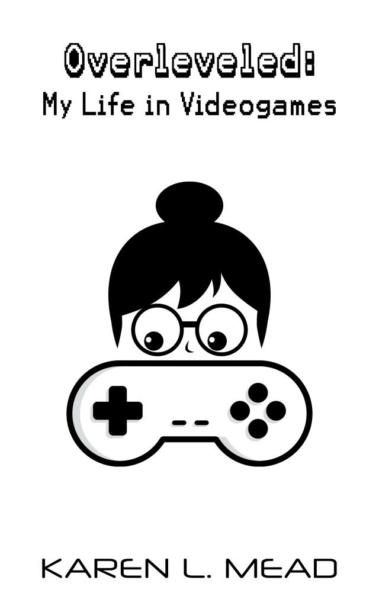

### Overleveled: My Life in Videogames

In Overleveled: My Life in Videogames, writer Karen L. Mead looks at her long history of gaming and tries to figure out what’s going on. How do the memories of time spent in imaginary worlds interface with our memories of real places? Is it possible for memories of games to be more genuine in some ways than memories of real locations, and if so, why?

Mead looks at incredibly popular, era-defining games like Super Mario Brothers, Final Fantasy VII and Starcraft among others to see how these games became both a part of her life and an escape from it.

[Buy on Amazon](https://www.amazon.com/dp/B08G4HC91Z/ref=sr_1_1?dchild=1&qid=1597770315&refinements=p_27%3AKaren+L.+Mead&s=digital-text&sr=1-1&text=Karen+L.+Mead)

[Buy on another platform](https://books2read.com/u/mVKnNl)
