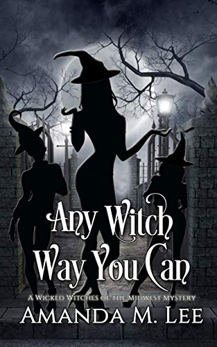

I read this book because I was trying to figure out just what the heck is going on with Amanda M. Lee, the author. Apparently Ms. Lee has been writing something like 20 books a year for about a decade, and now has over 200 books to her name. How is this possible? How can anyone write decent books at that kind of crazy pace? What is this SORCERY?

Well, I still don’t know what Lee’s secret is, but at least now I know that she does write decent books. Any Witch Way You Can didn’t rock my world, but it was a perfectly entertaining cozy mystery…at least, I think it’s a cozy mystery. More on that in a minute.

The Wicked Witches of the Midwest series has a clever premise. The small town of Hemlock Cove saw its businesses move elsewhere, so instead of giving up, the town rebranded itself as a kitschy tourist town. The whole town is witch-themed, kind of like Salem, Massachusetts but without the historical connection. In this environment, the Winchester women– a family full of real, honest-to-Hecate witches– can live freely, knowing that everyone will assume that their oddities are just part of the witchy role-playing that everyone in town does. On a meta level, there’s something darkly humorous about the idea that, in the face of globalization, the answer is to become a witch.

Any Witch Way You Can is the first installment of the Wicked Witches series, so a lot of page real estate is spent introducing Hemlock Cove and the various Winchesters. The story mainly focuses on Bay, editor of the the town’s weekly “newspaper,” (It’s more of an advertising blurb) and her younger cousins, Thistle and Clove. I know Lee has real newspaper experience, so I enjoy the details about Bay’s job. The other two sisters work at a magic shop, which sounds fun. I want to work at a magic shop that sells crystals and herbs and stuff!

Besides the above, the main thing you need to know about this series (and Lee’s work in general, from what I’ve heard) is that the characters are constantly arguing with each other, holding grudges, getting revenge on each other for slights real or imagined, etc. Lee even apologizes for this in the afterword, saying that she has a particular sense of humor and not everyone likes it. I’m on the fence myself: sometimes it’s funny, sometimes it just makes the characters seem incredibly immature, like they’re in middle school. Also, even when the characters hijinks are funny, it gets old when it just. Keeps. Happening. Always.

That said, I’m currently in the middle of Book 4 of this series, so obviously the style of the humor didn’t put me off that much. It’s still an entertaining series of mysteries…I just wish that this brand of humor could be toned down, not taken away entirely. Then again, Lee seems to be very successful in her niche of the mystery world, so I can’t think of any good reason why she should listen to me.

I’m honestly not sure if this is “cozy” mystery. For cozies, I imagine a nice lady who bakes pie every day and slowly investigates who stole the float for the town parade, or something mild like that. This book features two fairly gruesome murders, and to me that takes the coziness factor away. Is it possible cozy mysteries have been this hardcore for a while now, and I’m just showing my ignorance about the genre? I have much to learn about pie-baking sleuths, apparently.

So I recommend this series, with the caveat that if you like your protagonists to act smart and mature, this is probably not a story for you. But in the book I just read, Thistle and Bay had an angry snowball fight and Thistle dumped fresh snow down the back of Bay’s coat, and I am here for it.
