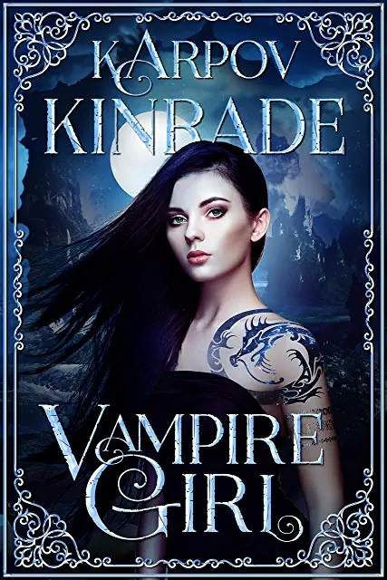

One of the things I’d like to do on this author blog is review some series that are in my preferred genres, so why not start today? This is a little bit risky, because someone might react to a critical review by having their fans review-bomb my books, but I’m not going to worry about that too much for right now. Today I’m talking about a series that I found pretty enjoyable, so that’s a non-issue. I mean…I think it’s a non-issue. You guys are nice, right Karpov Kinrade fans?

So, Vampire Girl! For starters, I’ve never read an ostensibly vampire-led series where vampirism is less important. Despite the title, the lead character is not a vampire, and blood drinking almost never comes up. There are a lot of characters who are vampires, but just about all of their blood-drinking occurs off-page. I can’t say the vampire angle is totally avoided, since there are a few scenes where it becomes relevant, but it’s an interesting choice to sideline most of the common vampire tropes. Maybe the author thinks we’re bored with them? They may be right.

(psst, Karpov Kinrade is actually a team, hence calling the author “they.” I’m not sure if I’m supposed to pretend it’s actually one author, but they’re pretty open about the situation so I’ll just go with “they” as the pronoun of choice here.)

The reason why this series can get away with playing the vampire business so lightly is because it’s really an epic fantasy dressed up in urban fantasy clothing. That’s not a bad thing (at least, not for me), but there’s an element of bait-and-switch here. The first 50 pages or so feel like an urban fantasy, with main girl Arianna hanging out in modern-day Portland, then she gets transported to the world of Inferna and the real world never matters again. Wait, no, I can think of one time where it matters, but that’s it. As much as I enjoyed the story, I do wish the real world featured more in it.

Once Arianna gets to Inferna (what we mere mortals might call Hell), there’s lots of problems to dig into. The vampires hate the fae, the fae hate the vampires, and there’s vampire-fae hybrids that are hated by everyone, and so on and so forth. Inferna is an interesting locale, but I’m not certain it ever felt truly real to me. Sometimes it felt like the place was really huge, and sometimes it felt really tiny, and that didn’t sit right with me. It’s a minor issue overall, but I think the worldbuilding could have been tighter.

Arianna has to date the Princes of Hell, all sexy vampires, if she wants to complete her quest. You’d think we’d be in paranormal romance territory…but actually, not so much. Once again, the set-up is deceptive. It seems at first like seeing all the different vampires romance Ari is going to be the main draw, then it quickly becomes about Arianna addressing the myriad social problems of Inferna, and dating takes a backseat.

Ari is a likable heroine, one who throws herself into the action without waiting for permission from anyone. She’s in danger of being too perfect, but her headstrong nature does count as an imperfection, I suppose; it certainly worries the Princes of Hell enough. This is where more time spent in the real world would have been helpful, because we’d learn more of what Ari is like when she isn’t in her prophesied-princess role, which comes with its own extensive list of tropes. As it is, we know her as well as we need to, and no more.

The series has two main arcs– the first four books, and the last three. During the first four, I was pretty engaged with the story, even though it made me raise an eyebrow at times. During the second arc, I was partially checked out. This is where Kindle Unlimited makes a difference, because it was easier to commit to finishing the series when I wasn’t paying for the books. If I didn’t have a KU subscription, I might have stopped somewhere in the middle of book six. The second arc isn’t bad (and the first-person narrative is fun), but it’s less compelling.

I would recommend this to readers who enjoy both urban fantasy and more traditional fantasy; if you only like one or the other, this series may annoy you with its habit of being about 12 genres at once. If you’re looking for paranormal romance, this series has what you’re looking for, but only in small doses; hardcore PNR fans may want to look elsewhere. Then again, even PNR fans like to read a nice epic fantasy with princes and princesses sometimes, right?
