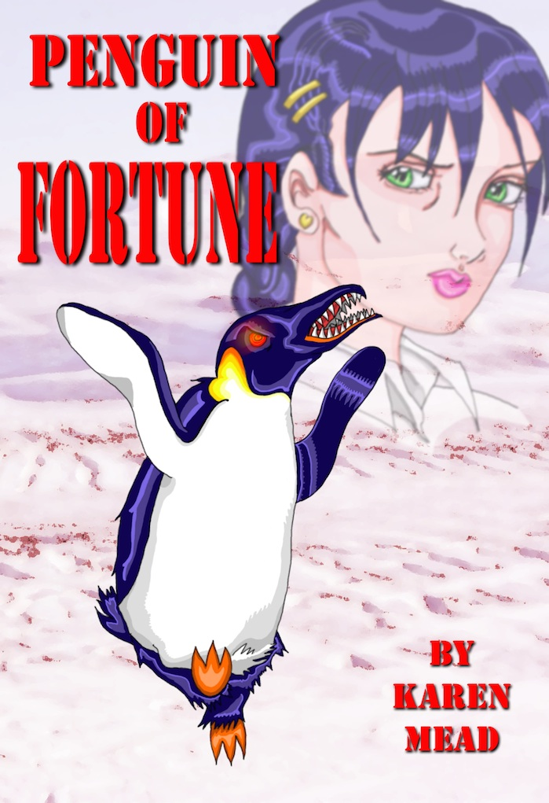

Check out Karen’s flagship series, [Demonic Café](https://www.amazon.com/gp/product/B079C8181P/?ie=UTF8&qid=1569632137&ref_=sr_1_7&refinements=p_27%3AKaren%20L.%20Mead&s=digital-text&sr=1-7&text=Karen%20L.%20Mead). The series is available for sale from most ebook vendors.

[A high-schooler just wants to study and get into a good college. How is she supposed to find the time to serve a Demon Lord?](https://www.amazon.com/Problem-Black-Magic-Familiar-Book-ebook/dp/B008EDUPNW/ref=sr_1_1?qid=1569631494&refinements=p_27%3AKaren+L.+Mead&s=digital-text&sr=1-1&text=Karen+L.+Mead)

Cassie divides her time between working a cash register and studying like crazy to get accepted to a top-tier university. She’s on track until one fateful day, a spell cast by one mysterious barista transforms her from a regular teen to a valuable familiar: a magical well a demon can tap. Now all the creatures of Hell are fighting over her, and the demon who bound her would rather serve lattes than deal with it. She’d be happy to protect herself, but how can she do that when she can’t even cast spells yet? Cassie had better figure it out fast, or else she has a better chance of becoming some demon’s little pet than making the Dean’s List.

Join Cassie in the first book of Demonic Café, a vibrant urban fantasy world of snarky demons, vicious black magic spells, political intrigue, and paranormal coffee…well, the coffee is normal, but it’s prepared by paranormal creatures. Drink at your own risk.

[Buy on Amazon](https://www.amazon.com/Problem-Black-Magic-Familiar-Book-ebook/dp/B008EDUPNW/ref=sr_1_1?dchild=1&keywords=The+Problem+with+Black+magic&qid=1598107644&sr=8-1)

[Buy on another platform](https://books2read.com/u/b5ZDY6)

[She’s supposed to be a witch. It would help if she could cast a spell.](https://www.amazon.com/Succession-Witches-Familiar-Book-2-ebook/dp/B00DEJA0EK/ref=sr_1_3?qid=1569631694&refinements=p_27%3AKaren+L.+Mead&s=digital-text&sr=1-3&text=Karen+L.+Mead)

It’s not easy being a teenaged witch. Or maybe it is? Cassie wouldn’t know, since she’s still a familiar: a magical well a demon can tap. She’s trying to learn magic, but the prereqs are a little scary and anyway, who has the time? There’s another familiar to snatch, snotty demons in dinner jackets to sort out, and political schemes that threaten the whole world order to foil.

Maybe before she starts slinging spells around, Cassie should learn who and what she really is. However, considering the fact she’s drawn the attention of the biggest, baddest witch around, who she is might not be as big a revelation as who she’s up against. She’d better get a clue fast, because the demons are still after her—and this time, they’ve brought company.

Join Cassie in the second book of Demonic Café, an exciting urban fantasy world filled with powerful demons, cheeky vampires, crafty witches, divine beasts, and lighting things on fire just for the hell of it.

[Buy on Amazon](https://www.amazon.com/gp/product/B00DEJA0EK?notRedirectToSDP=1&ref_=dbs_mng_calw_1&storeType=ebooks)

[Buy on another platform](https://books2read.com/u/mdlEYR)

[Young love is tough as it is. It’s even tougher when the guy you’re dating is technically your demonic master.](https://www.amazon.com/gp/product/B00M5CNQNY?notRedirectToSDP=1&ref_=dbs_mng_calw_2&storeType=ebooks)

Cassie has mixed feelings about progressing her relationship with Sam, her sort-of boyfriend, coffee-shop co-worker and demonic master. She does have feelings for him, but their whole relationship is just this side of creepy. This situation is not helped by the fact that Sam’s fellow demons are very close to declaring him too dangerous to live.

Now she and her friends have to travel to Las Vegas for Sam’s court hearing, which will determine whether he should be treated as a full-blooded demon under demonic law. If the trial goes badly for Sam, Cassie will be up for grabs. The last thing she wants is a bunch of demons fighting over her (again), but with the mysterious Seraph gunning for her (and all of her friends), who’s holding her leash may be the least of her problems. They say that what happens in Vegas stays in Vegas, but whoever said “The House Always Wins” probably never had several hundred demons in the house….

Join Cassie in the third book of Demonic Café, a magical urban fantasy world filled with handsome devils, sumptuous hotels, gorgeous gowns, and one Blessed Leviathan that never met a body of water it didn’t like.

[Buy on Amazon](https://www.amazon.com/gp/product/B00M5CNQNY?notRedirectToSDP=1&ref_=dbs_mng_calw_2&storeType=ebooks)

[Buy on another platform](https://books2read.com/u/47XwvA)

[It’s time for Cassie to take the SATs. That is, if the world still exists by Saturday.](https://www.amazon.com/gp/product/B07XG7YL2R?notRedirectToSDP=1&ref_=dbs_mng_calw_3&storeType=ebooks)

It’s finally time for Cassie to sit for the Test to End All Tests, only she has a problem: is the upcoming Apocalypse going to happen before the test, or after? Knowing that would really help her decide how much time to spend studying.

It’s not even clear who’s going to cause the Apocalypse. Will it be Cassie’s deranged relatives, tired of captivity? Will it be an army of magical phantasms, powerful beyond mortal comprehension and available in a stunning array of neon colors? Or will it be Sam, who’s realizing that his Antichrist potential is seriously off the charts (and can you believe it took him this long?)

Whatever form it takes, Cassie and Sam need to stop any and all Apocalypses even if they need to destroy the world to do it…and at the rate they’re going, they just might.

Join Cassie and Sam in the fourth book of Demonic Café, an epic urban fantasy world where going Old Testament on everyone is not only a viable option, but usually the best.

[Buy on Amazon](https://www.amazon.com/gp/product/B07XG7YL2R?notRedirectToSDP=1&ref_=dbs_mng_calw_3&storeType=ebooks)

[Some book in a series](http://www.amazon.com)

## Other Fantasy

[Badass bounty hunter Penelope Ripperson is tired of people going on and on about werewolves. What’s so great about wolves anyway? They’re just like dogs, only not as cute. In contrast, Pen’s pudgy bird form is both adorable and practical. Forget the lupine drama queens: Werepenguins are the new hotness in paranormal.](https://www.amazon.com/Penguin-Fortune-Karen-Mead-ebook/dp/B00TVO5DQW/ref=sr_1_6?qid=1569631858&refinements=p_27%3AKaren+L.+Mead&s=digital-text&sr=1-6&text=Karen+L.+Mead)

But now that mysterious police commissioner Clayton Crane has his eye on her, can Penelope keep her secret and protect the city from a new undead menace at the same time? More importantly, will she be able to make enough smart-mouth comments en route to prove how independent she is, even when she should just shut up and do her job?

Penguin of Fortune is a spine-tingling, pulse-pounding urban fantasy novella in the hot-female-bounty-hunter-with-magic-and-an-attitude genre, but also completely original because it has penguins in it, SO THERE.
